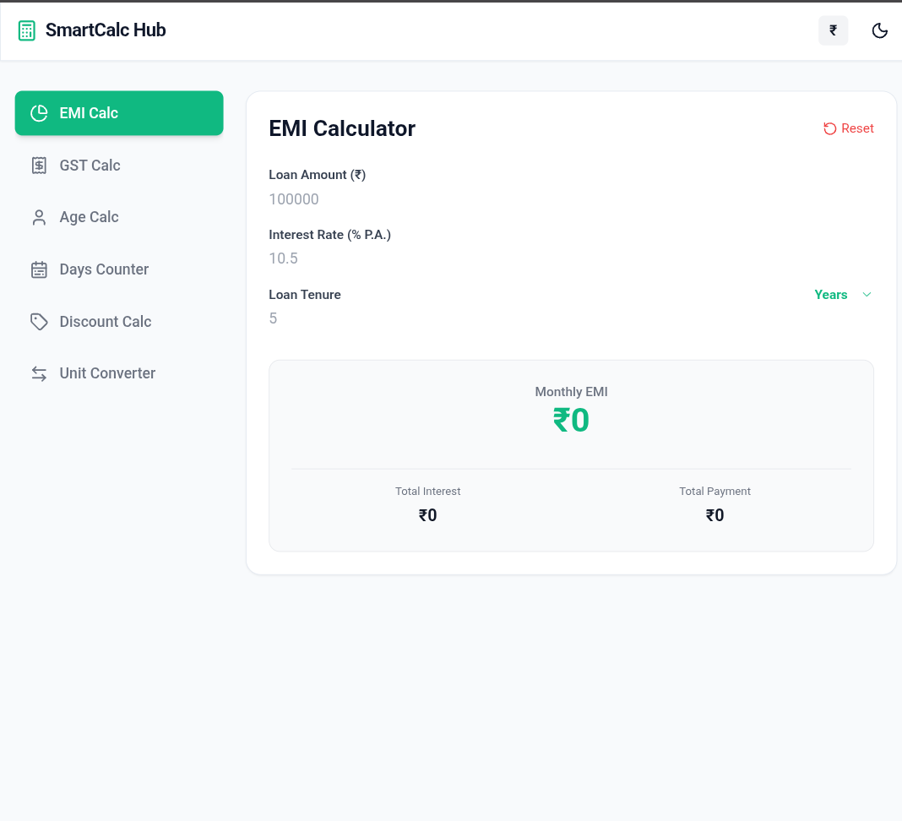
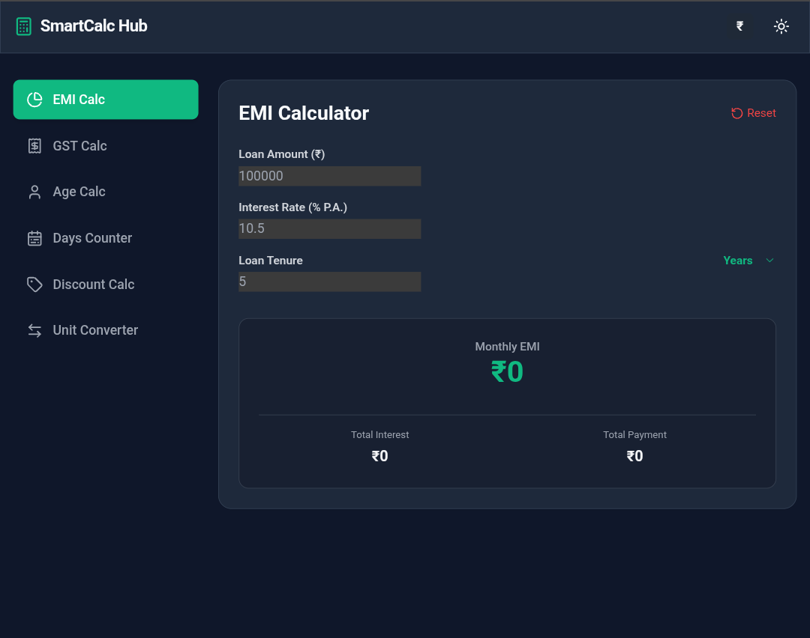

# 🧮 Smart Calculator Hub — Multi-Utility Calculator

A modern and premium calculator web app offering multiple smart calculation tools with a clean UI and responsive design.

🌐 **Live Demo:** https://smart-calculator-hub-txm1.onrender.com

---

## ✨ Features
- 🧮 Multiple calculator tools in one place  
- ⚡ Fast and accurate calculations  
- 📱 Fully responsive (Mobile + Desktop)  
- 🎯 Clean and user-friendly interface  
- 🌙 Modern UI experience  

---

## 🛠️ Built With
- HTML5  
- CSS3  
- JavaScript  

---

## 📸 Screenshots

  
  

---

## 🎯 Purpose
- Build a multi-utility calculator platform  
- Improve JavaScript logic and UI design  
- Create a practical real-world tool  

---

## 🚀 Future Enhancements
- 📊 Advanced calculators (EMI, BMI, etc.)  
- 🌐 API-based tools  
- 📱 Better mobile optimization  

---

**Designed & Developed by Aariz Khan**
